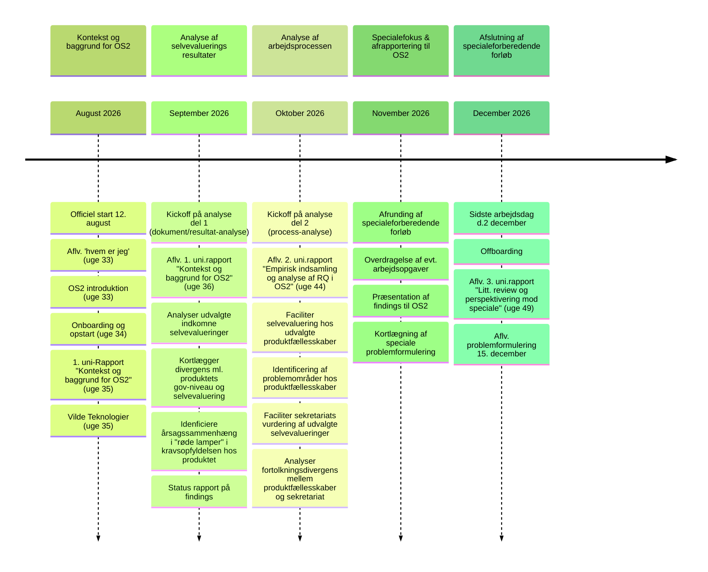

#### Specialeforberedende forløb hos OS2 i 2026

```mermaid
%% Help: Milestones are displayed using Mermaid timeline syntax. Please include a section for each milestone and identify all tasks releated to reaching the goal.
%% Mermaid documentation for timeline syntax: https://mermaid.js.org/syntax/timeline.html
%%{init: { 'theme': 'forest', 'timeline': {'disableMulticolor': true}}}%%
timeline
    section Kontekst og baggrund for OS2
      August 2026  : Officiel start 12. august
                  : Aflv. 'hvem er jeg' (uge 33)
                   : OS2 introduktion (uge 33)
                   : Onboarding og opstart (uge 34)
                   : 1. uni-Rapport "Kontekst og baggrund for OS2" (uge 35)
                   : Vilde Teknologier (uge 35)
      
    section Analyse af selvevaluerings resultater
      September 2026 : Kickoff på analyse del 1 (dokument/resultat-analyse)
                   : Aflv. 1. uni.rapport "Kontekst og baggrund for OS2" (uge 36)
                   : Analyser udvalgte indkomne selvevalueringer
                   : Kortlægger divergens ml. produktets gov-niveau og selvevaluering
                   : Idenficiere årsagssammenhæng i "røde lamper" i kravsopfyldelsen hos produktet
                   : Status rapport på findings


    section Analyse af arbejdsprocessen
     Oktober 2026  : Kickoff på analyse del 2 (process-analyse)
                   : Aflv. 2. uni.rapport "Empirisk indsamling og analyse af RQ i OS2" (uge 44)
                   : Faciliter selvevaluering hos udvalgte produktfællesskaber
                   : Identificering af problemområder hos produktfællesskaber
                   : Faciliter sekretariats vurdering af udvalgte selvevalueringer
                   : Analyser fortolkningsdivergens mellem produktfællesskaber og sekretariat


    section Specialefokus & afrapportering til OS2
     November 2026 : Afrunding af specialeforberedende forløb
                   : Overdragelse af evt. arbejdsopgaver
                   : Præsentation af findings til OS2
                   : Kortlægning af speciale problemformulering


    section Afslutning af specialeforberedende forløb
    December 2026 : Sidste arbejdsdag d.2 december
                  : Offboarding
                   : Aflv. 3. uni.rapport "Litt. review og perspektivering mod speciale" (uge 49)
                   : Aflv. problemformulering 15. december


    
```
