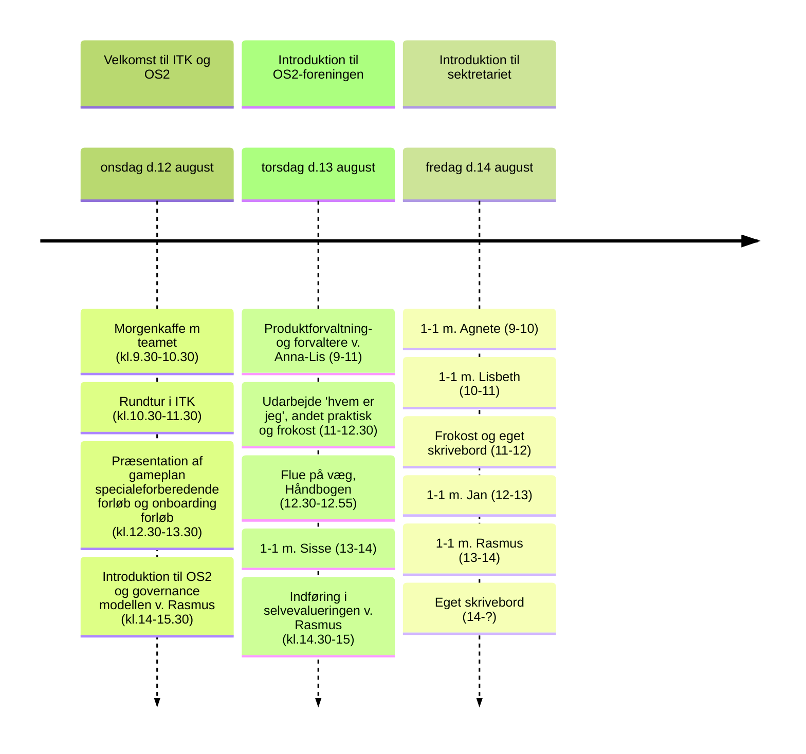
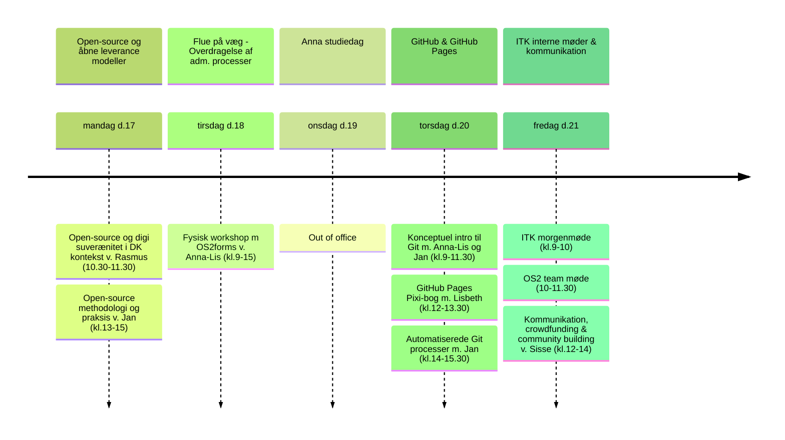
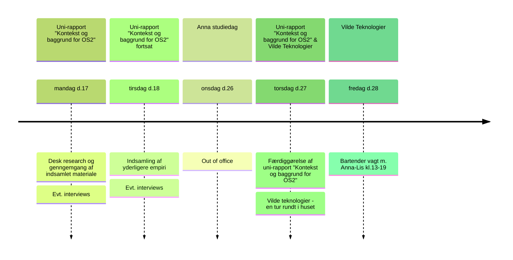

# Annas Onboarding

## Gameplans uge for uge

#### Uge 33 - Annas onboarding 

```mermaid
%% Help: Milestones are displayed using Mermaid timeline syntax. Please include a section for each milestone and identify all tasks releated to reaching the goal.
%% Mermaid documentation for timeline syntax: https://mermaid.js.org/syntax/timeline.html
%%{init: { 'theme': 'forest', 'timeline': {'disableMulticolor': true}}}%%
timeline
    section Velkomst til ITK og OS2 
      onsdag d.12 august : Morgenkaffe m teamet (kl.9.30-10.30)
                  : Rundtur i ITK (kl.10.30-11.30)
                  : Præsentation af gameplan specialeforberedende forløb og onboarding forløb (kl.12.30-13.30)
                  : Introduktion til OS2 og governance modellen v. Rasmus (kl.14-15.30)

      
    section Introduktion til OS2-foreningen 
      torsdag d.13 august : Produktforvaltning- og forvaltere v. Anna-Lis (9-11)
                  : Udarbejde 'hvem er jeg', andet praktisk og frokost (11-12.30)
                  : Flue på væg, Håndbogen (12.30-12.55)
                  : 1-1 m. Sisse (13-14)
                   : Indføring i selvevalueringen v. Rasmus (kl.14.30-15)


    section Introduktion til sektretariet 
     fredag d.14 august  : 1-1 m. Agnete (9-10)
                   : 1-1 m. Lisbeth (10-11)
                   : Frokost og eget skrivebord (11-12)
                   : 1-1 m. Jan (12-13)
                   : 1-1 m. Rasmus (13-14)
                   : Eget skrivebord (14-?)

    
```

#### Uge 34 - OS2 værktøjer og arbejdsmetoder

```mermaid
%% Help: Milestones are displayed using Mermaid timeline syntax. Please include a section for each milestone and identify all tasks releated to reaching the goal.
%% Mermaid documentation for timeline syntax: https://mermaid.js.org/syntax/timeline.html
%%{init: { 'theme': 'forest', 'timeline': {'disableMulticolor': true}}}%%
timeline
    section Open-source og åbne leverance modeller
      mandag d.17  : Open-source og digi suverænitet i DK kontekst v. Rasmus (10.30-11.30) 
                  : Open-source methodologi og praksis v. Jan (kl.13-15)
      
    section Flue på væg - Overdragelse af adm. processer
      tirsdag d.18 : Fysisk workshop m OS2forms v. Anna-Lis (kl.9-15)


    section Anna studiedag
     onsdag d.19  : Out of office
 

section GitHub & GitHub Pages 
      torsdag d.20 : Konceptuel intro til Git m. Anna-Lis og Jan (kl.9-11.30)
                   : GitHub Pages Pixi-bog m. Lisbeth (kl.12-13.30)
                   : Automatiserede Git processer m. Jan (kl.14-15.30)


    section ITK interne møder & kommunikation
     fredag d.21  : ITK morgenmøde (kl.9-10)
                   : OS2 team møde (10-11.30)
                   : Kommunikation, crowdfunding & community building v. Sisse (kl.12-14) 
    
```

#### Uge 35 - Kontekst og baggrund for OS2 & Vilde Teknologier

```mermaid
%% Help: Milestones are displayed using Mermaid timeline syntax. Please include a section for each milestone and identify all tasks releated to reaching the goal.
%% Mermaid documentation for timeline syntax: https://mermaid.js.org/syntax/timeline.html
%%{init: { 'theme': 'forest', 'timeline': {'disableMulticolor': true}}}%%
timeline
    section Uni-rapport "Kontekst og baggrund for OS2" 
      mandag d.17  : Desk research og genngemgang af indsamlet materiale 
                  : Evt. interviews
      
    section Uni-rapport "Kontekst og baggrund for OS2" fortsat
      tirsdag d.18 : Indsamling af yderligere empiri
                   : Evt. interviews

    section Anna studiedag
     onsdag d.26  : Out of office


    section Uni-rapport "Kontekst og baggrund for OS2" & Vilde Teknologier 
      torsdag d.27 : Færdiggørelse af uni-rapport "Kontekst og baggrund for OS2"
                   : Vilde teknologier - en tur rundt i huset


    section Vilde Teknologier
     fredag d.28  : Bartender vagt m. Anna-Lis kl.13-19

## Planlagte sessioner


```
